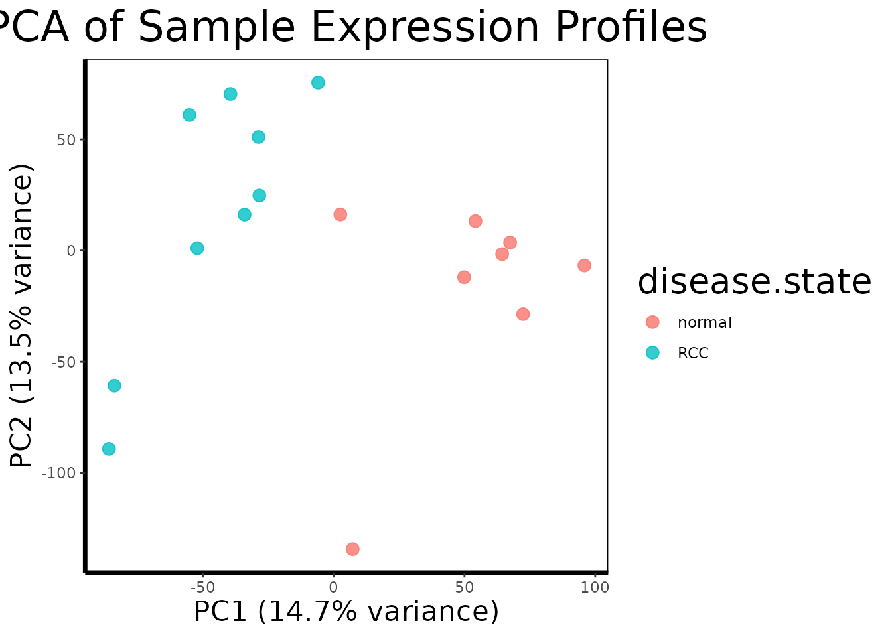
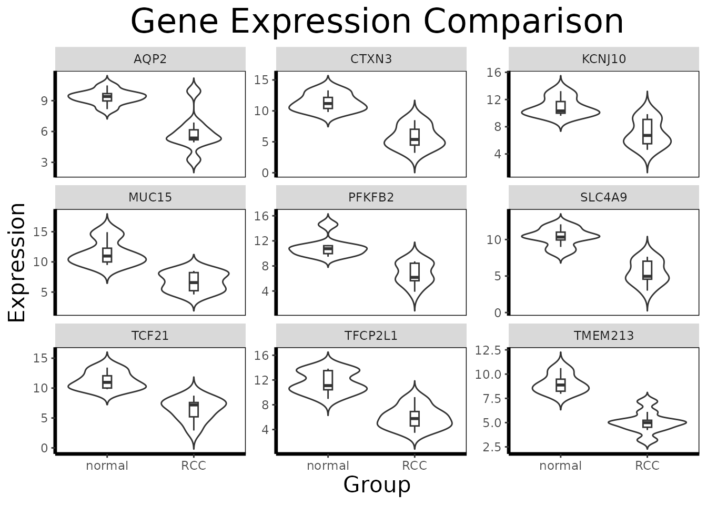
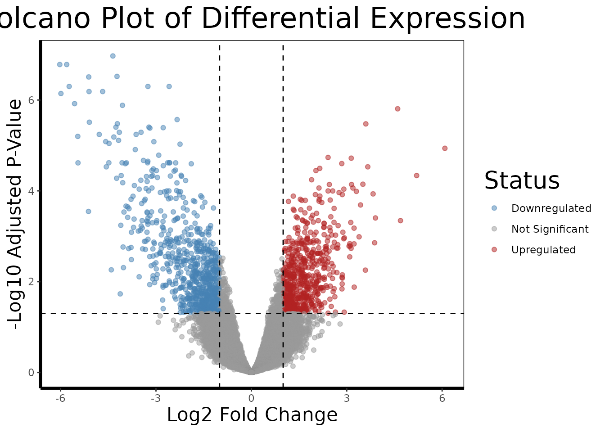
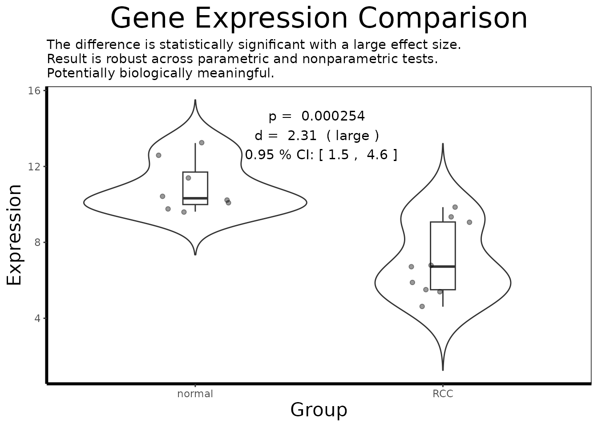
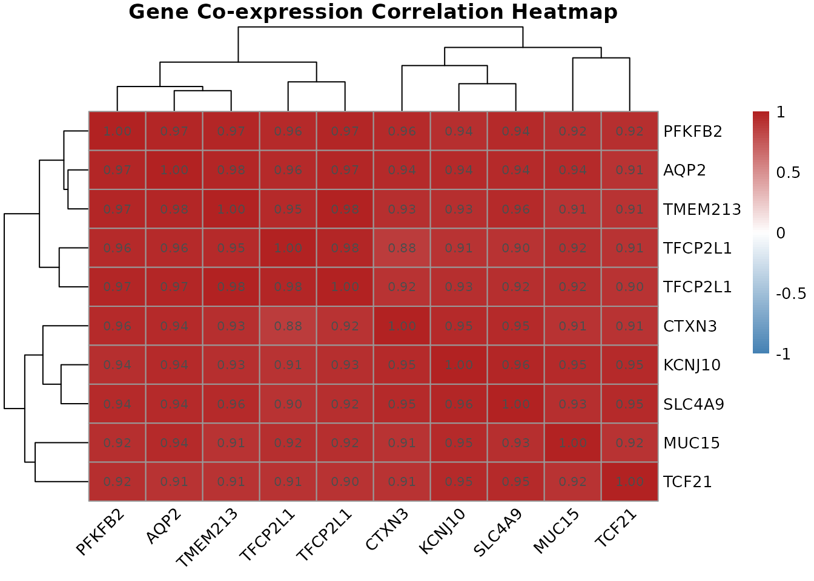

# BioUtils: A Case Study in Transcriptomic Analysis of Renal Cell Carcinoma

## Overview

Understanding which genes are expressed differently in diseased versus
healthy tissue is one of the central questions of modern molecular
biology. When a cell becomes cancerous, hundreds or thousands of genes
may change their activity levels, some becoming dramatically more
active, others effectively silenced. Identifying these changes is
essential for discovering what drives the disease, finding diagnostic
biomarkers, and ultimately developing targeted therapies.

This vignette walks through a complete transcriptomic analysis of
**renal cell carcinoma (RCC)**, the most common form of kidney cancer,
using publicly available gene expression microarray data from the NCBI
Gene Expression Omnibus (GEO). The dataset, **GDS507**, contains
expression profiles from 17 samples, a mix of clear cell RCC tumor
tissue and matched normal kidney tissue, measured across ~22,000 probe
sets on an Affymetrix HG-U133A microarray.

We will use the BioUtils package to carry out the full analytical
workflow: data import, quality control, differential expression
analysis, visualization, co-expression analysis, and multi-gene
predictive modeling. Each step is explained in terms of both what the
code is doing and what it means biologically.

------------------------------------------------------------------------

## Part 1: Data Import and Quality Control

### 1.1 What Is a Microarray?

Before we load data, it helps to understand what we are working with. A
DNA microarray is a glass slide or chip printed with tens of thousands
of short DNA sequences called **probes**, each designed to bind to the
RNA transcribed from a specific gene. When a biological sample is
processed and washed over the chip, messenger RNA from active genes
hybridizes to its matching probe and emits a fluorescent signal. The
brightness of each spot reflects how actively that gene is being
transcribed, its **expression level**.

The result is a table of ~22,000 numbers per sample, one for each probe
on the chip, representing the transcriptional activity of the cell at
the moment the sample was collected. Our job is to extract biologically
meaningful signal from this high-dimensional data.

### 1.2 Loading the Dataset

The GEO archive distributes datasets in SOFT format files. BioUtils
reads these directly using
[`load.geo.soft()`](https://github.com/SpencerTreadway/BioUtils/reference/load.geo.soft.md),
which wraps GEOquery to parse the file and return a structured
`ExpressionSet` object:

``` r
library(BioUtils)

eset <- load.geo.soft("", "GDS507", log.transform = TRUE)
```

The `log.transform = TRUE` argument is important here. Affymetrix arrays
report raw intensity values that span several orders of magnitude and
are right-skewed. Applying a log2 transformation compresses this range,
makes the data more symmetric, and means that differences in expression
become differences in fold change, a 1-unit increase on the log2 scale
represents a doubling of expression. This is standard preprocessing for
Affymetrix data and is necessary before any statistical testing.

### 1.3 Extracting the Data Components

[`extract.expression()`](https://github.com/SpencerTreadway/BioUtils/reference/extract.expression.md)
decomposes the `ExpressionSet` into the three components used throughout
BioUtils:

``` r
geo <- extract.expression(eset)
```

This returns a named list with:

- **`geo$expression`** - a 22,645 by 17 matrix of log2-transformed probe
  intensities. Each row is a probe (a specific DNA sequence on the
  chip), each column is a patient sample.
- **`geo$phenotype`** - a data frame of sample metadata. Most
  importantly for us, the `disease.state` column identifies each sample
  as either `"RCC"` or `"normal"`.
- **`geo$gene`** - a data frame of probe annotations mapping each probe
  ID to the gene it targets (gene symbol, full title, chromosomal
  location, etc.).

### 1.4 Principal Component Analysis for Quality Control

With 22,000 variables and 17 samples, the data is far too
high-dimensional to inspect directly. **Principal Component Analysis
(PCA)** is the standard first step for understanding the global
structure of the dataset. It finds the axes of maximum variance in the
data and projects each sample onto these axes, so that similar samples
cluster together in a 2D plot.

Before any analysis, we want to confirm that the largest source of
variation in the data is the biological signal we care about, disease
state, rather than technical artifacts like batch effects or sample
processing date.

``` r
pca.plot(geo$expression, geo$phenotype, color.by = "disease.state")
```



[`pca.plot()`](https://github.com/SpencerTreadway/BioUtils/reference/pca.plot.md)
runs PCA on the transposed expression matrix (so samples are the
observations and probes are the variables), extracts the first two
principal components, and plots each sample as a point colored by
disease state.

A well-separated PCA plot, with RCC and normal samples forming distinct
clusters, tells us that the transcriptional differences between tumor
and normal tissue are large enough to dominate the global variance
structure of the dataset. This is a reassuring quality control check: it
means the biology is strong and our statistical tests should have good
power to detect it. If instead the samples were mixed randomly or
clustered by something unrelated (a technician ID, a plate number), we
would need to investigate and correct for that before proceeding.

------------------------------------------------------------------------

## Part 2: Genome-Wide Differential Expression

### 2.1 The Statistical Challenge

We want to know, for each of the 22,645 probes, whether the average
expression level differs significantly between RCC and normal tissue.
The naive approach, run a t-test on each probe separately, has a
fundamental problem: if you run 22,645 independent tests at a 5%
significance threshold, you expect to get roughly 1,132 false positives
by chance alone, even if nothing is truly different. This is the
**multiple testing problem**.

### 2.2 Running limma

BioUtils uses the `limma` (Linear Models for Microarray data) framework
for differential expression analysis, which solves both problems
elegantly:

``` r
de.results <- run.limma.de(geo, condition.col = "disease.state")
```

Rather than testing each gene independently, `limma` fits a linear model
to all probes simultaneously. Its key innovation is **empirical Bayes
moderation**: it borrows variance information across all genes to
produce a stabilized estimate of within-group variability for each
probe. Genes with few samples or noisy measurements benefit from this
pooled information, which prevents genes with accidentally small
variance estimates from generating artificially inflated t-statistics.

The result, called a **TopTable**, is a data frame with one row per
probe, sorted by evidence of differential expression. The most important
columns are:

- **`logFC`** - the log2 fold change between RCC and normal tissue. A
  value of 2 means RCC samples express that gene 4-fold higher on
  average. A value of -1 means expression is halved in RCC.
- **`adj.P.Val`** - the p-value after **Benjamini-Hochberg correction**
  for multiple testing. This controls the **false discovery rate
  (FDR)**: an `adj.P.Val` of 0.05 means we expect 5% of the probes we
  call significant to be false positives, rather than 5% of *all* tests
  to be wrong.

``` r
# Look at the top 10 most significantly differentially expressed probes
head(de.results[order(de.results$adj.P.Val), ], 10)
#>               logFC   AveExpr         t      P.Value    adj.P.Val        B
#> 228581_at -4.356150  7.675183 -15.41548 4.729249e-12 1.070939e-07 17.10870
#> 236630_at -6.025968 10.544520 -14.24191 1.851007e-11 1.651488e-07 15.94545
#> 231391_at -5.808044  7.192175 -14.10346 2.187884e-11 1.651488e-07 15.80081
#> 227238_at -4.226197  6.619400 -13.38519 5.328108e-11 3.016375e-07 15.02365
#> 233183_at -5.114477  6.485488 -13.18816 6.848514e-11 3.101692e-07 14.80233
#> 226733_at -2.586442  9.826367 -12.63571 1.407730e-10 5.020745e-07 14.16213
#> 229529_at -3.253671  7.960713 -12.47185 1.751676e-10 5.020745e-07 13.96651
#> 240183_at -5.729856  8.225030 -12.46252 1.773723e-10 5.020745e-07 13.95530
#> 227642_at -5.106025 10.616703 -12.13381 2.769970e-10 6.501757e-07 13.55437
#> 229341_at -4.676905  8.043225 -12.10765 2.871167e-10 6.501757e-07 13.52198
```

### 2.3 The Volcano Plot

A volcano plot is the standard visualization for a differential
expression result set. It places every probe in a two-dimensional space:
fold change on the x-axis (how large the difference is) and statistical
significance on the y-axis (how confident we are in that difference).
The most biologically interesting genes, large effect, high confidence,
appear in the upper corners.

``` r
volcano.plot(de.results, fc.threshold = 1, fdr.threshold = 0.05)
```


The dashed lines mark our thresholds: genes must have an absolute log2
fold change greater than 1 (a 2-fold change) AND an FDR-adjusted p-value
below 0.05 to be colored as differentially expressed. Genes in red are
upregulated in RCC relative to normal; genes in blue are downregulated.

In kidney cancer, we might expect to see upregulation of genes involved
in angiogenesis (tumor blood vessel formation), glycolysis (many kidney
cancers switch their metabolism even under normal oxygen levels, the
Warburg effect), and cell proliferation, while genes involved in normal
kidney function and differentiation may be downregulated.

### 2.4 Identifying Top Candidates

We now extract the probe IDs of the most significantly differentially
expressed genes to carry forward into deeper analysis:

``` r
# Extract the 10 most significant probe IDs (row names of the TopTable)
top.probes <- rownames(head(de.results[order(de.results$adj.P.Val), ], 10))

# Resolve probe IDs to human-readable gene names
top.genes <- get.gene.name(geo$gene, top.probes)

# Some probes on the array do not map to annotated genes, remove those
annotated.mask <- which(top.genes != "")
top.probes <- top.probes[annotated.mask]
top.genes <- top.genes[annotated.mask]

cat("Top differentially expressed genes:\n")
#> Top differentially expressed genes:
print(top.genes)
#>  [1] "6-phosphofructo-2-kinase/fructose-2,6-biphosphatase 2"
#>  [2] "mucin 15, cell surface associated"                    
#>  [3] "transcription factor CP2-like 1"                      
#>  [4] "potassium voltage-gated channel subfamily J member 10"
#>  [5] "transcription factor CP2-like 1"                      
#>  [6] "transcription factor 21"                              
#>  [7] "cortexin 3"                                           
#>  [8] "solute carrier family 4 member 9"                     
#>  [9] "aquaporin 2"                                          
#> [10] "transmembrane protein 213"
```

[`get.gene.name()`](https://github.com/SpencerTreadway/BioUtils/reference/get.gene.name.md)
performs the reverse lookup of
[`find.probe.by.gene()`](https://github.com/SpencerTreadway/BioUtils/reference/find.probe.by.gene.md),
given probe IDs from the TopTable, it retrieves the human-readable gene
title from the annotation data frame. The filtering step removes probes
that are present on the array but have no gene annotation in the
database (common in older array designs).

------------------------------------------------------------------------

## Part 3: Deep-Dive Single-Gene Analysis

The limma TopTable tells us *which* genes are differentially expressed.
Now we use BioUtils to understand *how* they are expressed, the
magnitude, direction, and robustness of each gene’s difference.

### 3.1 Retrieving and Preparing Expression Data

``` r
# Retrieve expression values for all top probes as a matrix
expr.mat <- get.gene.expression(geo$expression, top.probes)

# Build the long-format analysis data frame
df.multi <- build.analysis.df(expr.mat, geo$phenotype, geo$gene)
```

[`get.gene.expression()`](https://github.com/SpencerTreadway/BioUtils/reference/get.gene.expression.md)
slices the rows of the full expression matrix corresponding to our
selected probes.
[`build.analysis.df()`](https://github.com/SpencerTreadway/BioUtils/reference/build.analysis.df.md)
then pivots this wide matrix (probes by samples) into a **long-format**
data frame where each row represents one gene-sample observation, with
columns for gene name, expression value, and disease state group. This
format is required by all downstream analysis and visualization
functions.

### 3.2 Multi-Gene Overview

``` r
# Faceted violin + boxplot across all top genes simultaneously
gene.analysis.plot(df.multi)
```



In multi-gene mode,
[`gene.analysis.plot()`](https://github.com/SpencerTreadway/BioUtils/reference/gene.analysis.plot.md)
creates a faceted panel, one violin/boxplot per gene, allowing visual
comparison of expression patterns across the entire candidate set at
once. This is useful for identifying which genes show large, clean
separation between groups and which show more overlap or outlier-driven
differences.

### 3.3 Focused Single-Gene Analysis

For the gene showing the most dramatic separation, we perform a full
statistical analysis:

``` r
# Subset to a single gene of interest
gene.of.interest <- get.gene.name(geo$gene, top.probes[1], use.symbols=TRUE)
df.single <- df.multi[which(df.multi$gene == gene.of.interest), ]

# Annotated single-gene visualization
gene.analysis.plot(df.single)
```


In single-gene mode,
[`gene.analysis.plot()`](https://github.com/SpencerTreadway/BioUtils/reference/gene.analysis.plot.md)
runs
[`analyze.gene()`](https://github.com/SpencerTreadway/BioUtils/reference/analyze.gene.md)
internally and annotates the plot with the key statistical results.

### 3.4 Understanding `analyze.gene()`

``` r
result <- analyze.gene(df.single)
cat(result$interpretation)
#> The difference is statistically significant with a large effect size.
#> Result is robust across parametric and nonparametric tests.
#> Potentially biologically meaningful.
```

[`analyze.gene()`](https://github.com/SpencerTreadway/BioUtils/reference/analyze.gene.md)
integrates multiple statistical perspectives into a single object. It is
worth understanding what each component contributes:

**The adaptive t-test** (`result$raw$parametric`): BioUtils first runs
[`var.test()`](https://rdrr.io/r/stats/var.test.html) to check whether
the two groups have equal variances. If they do not (a common occurrence
in gene expression data, where disease states often increase expression
variability), it automatically uses **Welch’s t-test**, which does not
assume equal variances, rather than the standard Student’s t-test. This
prevents a common source of inflated false positives.

**Cohen’s d** (`result$effect.size`): A p-value alone does not tell you
whether a statistically significant difference is biologically
meaningful. With 17 samples, even a tiny difference in means can reach
statistical significance. Cohen’s d is a **standardized effect size**,
the difference in group means divided by the pooled standard deviation,
that puts the magnitude of the difference in context. A d of 0.2 is
small; 0.5 is moderate; 0.8 or above is large. In a clinical context,
genes with small effect sizes are unlikely to serve as robust biomarkers
even if they are highly significant.

**Bootstrapped confidence interval** (`result$confidence.interval`): The
confidence interval around Cohen’s d quantifies our uncertainty about
the true effect size given the sample size. A narrow CI (e.g., \[0.8,
1.2\]) means we have a precise estimate; a wide CI (e.g., \[0.1, 1.5\])
means the true effect could be anywhere from negligible to very large,
and we should be cautious about strong claims.

**The Wilcoxon rank-sum test** (`result$nonparametric.p`): The t-test
assumes that expression values are roughly normally distributed within
each group. Gene expression data often violates this assumption,
particularly when one group has outlier samples. The Wilcoxon test makes
no distributional assumptions and provides an independent check. When
both tests agree (`result$robustness`), we can be more confident in the
result. When they disagree, t-test significant, Wilcoxon not, the result
may be driven by distributional differences rather than a genuine shift
in the population mean.

``` r
# Inspect individual components
cat("Effect size (Cohen's d):", round(result$effect.size, 3), "\n")
#> Effect size (Cohen's d): 2.312
cat("Effect size class:      ", result$effect.size.class, "\n")
#> Effect size class:       large
cat("95% CI:                 [",
    round(result$confidence.interval$lower, 3), ",",
    round(result$confidence.interval$upper, 3), "]\n")
#> 95% CI:                 [ 1.53 , 4.54 ]
cat("Parametric p-value:     ", signif(result$p.value, 3), "\n")
#> Parametric p-value:      0.000254
cat("Nonparametric p-value:  ", signif(result$nonparametric.p, 3), "\n")
#> Nonparametric p-value:   0.000329
cat("Robustness:             ", result$robustness, "\n")
#> Robustness:              robust across parametric and nonparametric tests
cat("Biological assessment:  ", result$biological.relevance, "\n")
#> Biological assessment:   Potentially biologically meaningful
```

------------------------------------------------------------------------

## Part 4: Pathway-Level Interpretation with GSEA

So far every analysis has focused on individual genes, which ones are
differentially expressed, how large their effects are, and which ones
jointly predict disease state. But genes do not act in isolation. They
participate in coordinated **biological pathways**: cascades of
molecular events that together accomplish a cellular function. The limma
TopTable tells us *which* genes change; Gene Set Enrichment Analysis
(GSEA) tells us *what those changes mean* at the level of biology.

### 4.1 What Is a Gene Set?

A **gene set** is simply a curated list of genes known to participate in
the same biological process. The Molecular Signatures Database (MSigDB)
maintains thousands of such sets organized into collections. The most
widely used collection for disease studies is the **Hallmark**
collection (`category = "H"`), which contains 50 gene sets representing
well-defined biological states, things like “HYPOXIA”, “MYC_TARGETS_V1”,
“INFLAMMATORY_RESPONSE”, and “EPITHELIAL_MESENCHYMAL_TRANSITION”. Each
set was assembled by expert curation to be coherent and minimally
overlapping with the others.

For kidney cancer specifically, we might expect to see strong enrichment
of hypoxia-related gene sets. Clear cell RCC commonly inactivates the
*VHL* tumor suppressor gene, which normally targets the
HIF1transcription factor for degradation. Without VHL, HIF1accumulates
and drives a transcriptional program mimicking chronic oxygen
deprivation, activating genes for blood vessel formation, glucose
uptake, and anaerobic metabolism. This is one of the best-characterized
molecular signatures in all of oncology, and GSEA is an ideal tool for
detecting it.

### 4.2 Loading Gene Sets

We use the `msigdbr` package to download the Hallmark gene sets as a
named list, which is the format
[`run.gsea()`](https://github.com/SpencerTreadway/BioUtils/reference/run.gsea.md)
expects:

``` r
# Download Hallmark gene sets for Homo sapiens
hallmark.df <- msigdbr::msigdbr(species = "Homo sapiens", category = "H")

# Convert to a named list: pathway name -> character vector of gene symbols
pathways <- split(hallmark.df$gene_symbol, hallmark.df$gs_name)

# Each element is a vector of gene symbols belonging to that pathway
cat("Number of Hallmark gene sets:", length(pathways), "\n")
#> Number of Hallmark gene sets: 50
cat("Example - first 6 genes in HALLMARK_HYPOXIA:\n")
#> Example - first 6 genes in HALLMARK_HYPOXIA:
print(head(pathways[["HALLMARK_HYPOXIA"]]))
#> [1] "ACKR3"   "ADM"     "ADORA2B" "AK4"     "AKAP12"  "ALDOA"
```

### 4.3 Running GSEA

GSEA works on a **ranked gene list**, all genes in the experiment
ordered from most upregulated to most downregulated, rather than a
filtered list of significant hits. This is an important distinction from
simpler enrichment methods that only ask “are pathway genes
over-represented among my significant hits?” GSEA asks “do pathway genes
cluster at the top or bottom of the full ranked list?” which makes it
sensitive to coordinated shifts across an entire pathway even when no
individual gene clears a significance threshold.

The ranking metric used by
[`run.gsea()`](https://github.com/SpencerTreadway/BioUtils/reference/run.gsea.md)
is log2 fold change from the limma TopTable: genes at the top are the
most upregulated in RCC relative to normal, and genes at the bottom are
the most downregulated.

``` r
gsea.results <- run.gsea(de.results, geo$gene, pathways, min.size = 15, max.size = 500)

# Sort by adjusted p-value and inspect the top enriched pathways
gsea.results <- gsea.results[order(gsea.results$padj), ]
print(head(gsea.results[, c("pathway", "NES", "pval", "padj", "size")], 10))
#>                                        pathway       NES         pval
#>                                         <char>     <num>        <num>
#>  1:         HALLMARK_INTERFERON_GAMMA_RESPONSE  2.583617 7.169261e-11
#>  2:               HALLMARK_ALLOGRAFT_REJECTION  2.347024 8.755287e-07
#>  3:           HALLMARK_TNFA_SIGNALING_VIA_NFKB  2.169456 8.485207e-06
#>  4:         HALLMARK_INTERFERON_ALPHA_RESPONSE  2.037790 1.983990e-04
#>  5: HALLMARK_EPITHELIAL_MESENCHYMAL_TRANSITION  1.841121 2.721379e-04
#>  6:                           HALLMARK_HYPOXIA  1.793828 1.042539e-03
#>  7:             HALLMARK_INFLAMMATORY_RESPONSE  1.785555 1.591620e-03
#>  8:         HALLMARK_OXIDATIVE_PHOSPHORYLATION -1.771289 1.634470e-03
#>  9:             HALLMARK_XENOBIOTIC_METABOLISM -1.788475 1.528082e-03
#> 10:                  HALLMARK_MTORC1_SIGNALING  1.653165 3.837878e-03
#>             padj  size
#>            <num> <int>
#>  1: 3.226168e-09    67
#>  2: 1.969940e-05    38
#>  3: 1.272781e-04    59
#>  4: 2.231989e-03    32
#>  5: 2.449241e-03    64
#>  6: 7.819042e-03    63
#>  7: 8.172351e-03    58
#>  8: 8.172351e-03    56
#>  9: 8.172351e-03    50
#> 10: 1.727045e-02    69
```

### 4.4 Interpreting the Results

The two most important columns in the GSEA output are:

**`NES` (Normalized Enrichment Score):** The core statistic of GSEA. A
positive NES means the gene set is enriched among genes upregulated in
RCC, the genes belonging to this pathway tend to cluster at the top of
the ranked list. A negative NES means the pathway is enriched among
downregulated genes, suppressed in RCC relative to normal tissue. The
normalization accounts for gene set size, so NES values are comparable
across sets.

**`padj`:** The NES is tested for significance by permuting the gene
labels and recomputing enrichment scores under the null hypothesis that
genes are randomly distributed in the ranked list. `padj` is the
resulting p-value after Benjamini-Hochberg correction across all tested
pathways.

**`leadingEdge`:** The subset of genes from the pathway that contribute
most to driving the enrichment score. These are the most biologically
interesting genes within an enriched pathway, the ones at the “leading
edge” of the ranked list. They are strong candidates for follow-up with
[`analyze.gene()`](https://github.com/SpencerTreadway/BioUtils/reference/analyze.gene.md).

``` r
# Extract the leading edge genes of the top enriched pathway
top.pathway <- gsea.results$pathway[1]
leading.genes <- unlist(gsea.results$leadingEdge[1])

cat("Top enriched pathway:", top.pathway, "\n")
#> Top enriched pathway: HALLMARK_INTERFERON_GAMMA_RESPONSE
cat("Leading edge genes:\n")
#> Leading edge genes:
print(leading.genes)
#>  [1] "ST8SIA4" "IRF1"    "SAMHD1"  "SSPN"    "GBP4"    "SLAMF7"  "XAF1"   
#>  [8] "IL18BP"  "NLRC5"   "RSAD2"   "LATS2"   "LCP2"    "CMPK2"   "OAS3"   
#> [15] "PTPN2"   "ZNFX1"   "RNF213"  "SAMD9L"  "CMKLR1"  "HELZ2"   "RAPGEF6"
#> [22] "NAMPT"   "IFIT3"   "STAT1"   "IFNAR2"  "PARP14"  "SP110"   "PELI1"  
#> [29] "CD274"   "EPSTI1"  "OAS2"    "IFIT2"   "RBCK1"   "ZBP1"    "EIF2AK2"
#> [36] "STAT2"   "BANK1"   "PML"     "TRIM25"  "NOD1"    "LYSMD2"  "ARID5B"

# Find probes for the leading edge genes and perform single-gene deep-dives
leading.probes <- find.probe.by.gene(geo$gene, leading.genes)
leading.probes <- leading.probes[leading.probes != ""]

if(length(leading.probes) > 0)
{
  leading.expr <- get.gene.expression(geo$expression, leading.probes)
  df.leading <- build.analysis.df(leading.expr, geo$phenotype, geo$gene)
  gene.analysis.plot(df.leading)
}
```

This closes the analytical loop: GSEA identifies which biological
programs are dysregulated in RCC at the pathway level, and the leading
edge genes point us back to the individual-gene tools,
[`analyze.gene()`](https://github.com/SpencerTreadway/BioUtils/reference/analyze.gene.md)
and
[`gene.analysis.plot()`](https://github.com/SpencerTreadway/BioUtils/reference/gene.analysis.plot.md),
to characterize the most important drivers within each pathway.

------------------------------------------------------------------------

## Part 5: Multi-Gene Relationships

Individual gene analysis tells us about each gene in isolation. But
biology is a system, genes do not act alone. They are connected in
regulatory networks, share transcription factors, and participate in
common pathways. BioUtils provides two complementary tools for exploring
these multi-gene relationships.

### 5.1 Co-expression Correlation Heatmap

Genes that are regulated together tend to show correlated expression
patterns across samples: when one goes up, the other goes up. These
**co-expression relationships** can suggest shared regulatory control,
functional partnership, or membership in the same biological pathway.

``` r
# Compute pairwise Pearson correlations between our top probes
cor.mat <- gene.correlation.matrix(geo$expression, top.probes, method = "pearson")

# Visualize with hierarchical clustering
correlation.heatmap.plot(cor.mat, gene.names = get.gene.name(geo$gene, top.probes, use.symbols=TRUE))
```


[`gene.correlation.matrix()`](https://github.com/SpencerTreadway/BioUtils/reference/gene.correlation.matrix.md)
computes the full pairwise correlation matrix across all samples.
[`correlation.heatmap.plot()`](https://github.com/SpencerTreadway/BioUtils/reference/correlation.heatmap.plot.md)
then visualizes this as a clustered heatmap, where hierarchical
clustering reorders rows and columns so that genes with similar
co-expression profiles are placed next to each other. Red cells indicate
strongly co-expressed gene pairs; blue cells indicate anti-correlated
pairs (when one goes up, the other tends to go down).

Clusters of co-expressed genes visible in the heatmap often correspond
to genes in the same biological pathway or under the control of the same
transcription factor. In a renal cell carcinoma context, you might see a
cluster of angiogenesis-related genes (driven by HIF1pathway activation,
common in RCC) all moving together, or a cluster of genes involved in
fatty acid metabolism.

### 5.2 LASSO Regression for Predictive Biomarker Discovery

Co-expression tells us about correlations. But a separate question is:
which genes, **taken together**, best discriminate RCC from normal
tissue? This is a classification problem, and it is where
[`fit.lasso()`](https://github.com/SpencerTreadway/BioUtils/reference/fit.lasso.md)
comes in.

``` r
# Encode disease state as a binary outcome variable
phenotype.binary <- ifelse(geo$phenotype$disease.state == "RCC", 1, 0)

# Fit LASSO logistic regression across all top probes simultaneously
lasso.fit <- fit.lasso(geo$expression, phenotype.binary)

# Extract genes selected by LASSO at the 1-standard-error lambda
coef.mat <- coef(lasso.fit, s = "lambda.1se")
selected  <- coef.mat[coef.mat[, 1] != 0, ]
print(selected)
#> (Intercept)   222405_at   223798_at   226733_at   226851_at   227238_at 
#>  4.58244434 -0.49969262  0.59096443 -0.59527813 -0.02235620 -0.05695169 
#>   227367_at   228581_at   229529_at   231391_at 
#>  1.09276938 -0.41421102 -0.43068340 -0.03464796
```

**Why LASSO?** Standard logistic regression cannot be applied here: we
have more probes than samples, and many of the top genes are correlated
with each other (as shown in the heatmap). LASSO (Least Absolute
Shrinkage and Selection Operator) adds a penalty term to the logistic
regression that forces most gene coefficients to exactly zero, keeping
only those with **independent predictive value** when all other selected
genes are accounted for.

`cv.glmnet()` determines the optimal penalty strength through 10-fold
cross-validation. At `lambda.1se`, the most regularized model within one
standard error of the minimum cross-validation error, LASSO returns the
sparsest model that still predicts well, which tends to be the most
interpretable and generalizable.

The genes with non-zero coefficients in the selected output are
BioUtils’s answer to the question: “If you could only measure a handful
of genes to diagnose RCC from a biopsy, which ones would give you the
most information?” These are strong candidates for further validation as
diagnostic biomarkers.

This is complementary to the limma DE analysis: limma identifies genes
that differ **individually** between groups, while LASSO identifies the
minimal set of genes that **jointly** carry discriminative information.
A gene might be highly significant in limma but dropped by LASSO because
its information is redundant with another gene in the panel.

------------------------------------------------------------------------

## Part 6: The Complete Workflow

The full analysis, from raw SOFT file to multi-gene biomarker panel, can
be expressed as a coherent pipeline:

``` r
library(BioUtils)

# == 1. Import =================================================================
eset <- load.geo.soft("", "GDS507", log.transform = TRUE)
geo <- extract.expression(eset)

# == 2. Quality Control ========================================================
pca.plot(geo$expression, geo$phenotype, color.by = "disease.state")
```


``` r

# == 3. Genome-Wide Differential Expression ====================================
de.results <- run.limma.de(geo, condition.col = "disease.state")
volcano.plot(de.results, fc.threshold = 1, fdr.threshold = 0.05)
```



``` r

# == 4. Select Top Candidates ==================================================
top.probes <- rownames(head(de.results[order(de.results$adj.P.Val), ], 10))
top.genes <- get.gene.name(geo$gene, top.probes)
valid.mask <- which(top.genes != "")
top.probes <- top.probes[valid.mask]
top.genes <- top.genes[valid.mask]

# == 5. Build Analysis Data Frame ==============================================
expr.mat <- get.gene.expression(geo$expression, top.probes)
df.multi <- build.analysis.df(expr.mat, geo$phenotype, geo$gene)

# == 6. Multi-Gene Visualization ===============================================
gene.analysis.plot(df.multi)
```


``` r

# == 7. Single-Gene Deep-Dive ==================================================
df.single <- df.multi[which(df.multi$gene == get.gene.name(geo$gene, top.probes[1], use.symbols=TRUE)), ]
gene.analysis.plot(df.single)
```



``` r
result <- analyze.gene(df.single)
cat(result$interpretation)
#> The difference is statistically significant with a large effect size.
#> Result is robust across parametric and nonparametric tests.
#> Potentially biologically meaningful.

# == 8. Co-expression Analysis =================================================
cor.mat <- gene.correlation.matrix(geo$expression, top.probes, method = "pearson")
correlation.heatmap.plot(cor.mat, gene.names = get.gene.name(geo$gene, top.probes, use.symbols=TRUE))
```



``` r

# == 9. Pathway Enrichment =====================================================
hallmark.df <- msigdbr::msigdbr(species = "Homo sapiens", category = "H")
pathways <- split(hallmark.df$gene_symbol, hallmark.df$gs_name)
gsea.results <- run.gsea(de.results, geo$gene, pathways)
gsea.results <- gsea.results[order(gsea.results$padj), ]
print(head(gsea.results[, c("pathway", "NES", "pval", "padj")], 10))
#>                                        pathway       NES         pval
#>                                         <char>     <num>        <num>
#>  1:         HALLMARK_INTERFERON_GAMMA_RESPONSE  2.540590 2.943309e-11
#>  2:               HALLMARK_ALLOGRAFT_REJECTION  2.315881 4.364220e-07
#>  3:           HALLMARK_TNFA_SIGNALING_VIA_NFKB  2.129535 4.293445e-06
#>  4:         HALLMARK_INTERFERON_ALPHA_RESPONSE  2.006157 2.727998e-04
#>  5: HALLMARK_EPITHELIAL_MESENCHYMAL_TRANSITION  1.800979 1.117685e-03
#>  6:                           HALLMARK_HYPOXIA  1.745162 1.599011e-03
#>  7:           HALLMARK_IL6_JAK_STAT3_SIGNALING  1.811958 2.022563e-03
#>  8:             HALLMARK_INFLAMMATORY_RESPONSE  1.751199 2.088253e-03
#>  9:         HALLMARK_OXIDATIVE_PHOSPHORYLATION -1.745711 2.053582e-03
#> 10:                 HALLMARK_KRAS_SIGNALING_UP  1.632227 2.792723e-03
#>             padj
#>            <num>
#>  1: 1.324489e-09
#>  2: 9.819496e-06
#>  3: 6.440167e-05
#>  4: 3.068998e-03
#>  5: 1.005917e-02
#>  6: 1.044126e-02
#>  7: 1.044126e-02
#>  8: 1.044126e-02
#>  9: 1.044126e-02
#> 10: 1.256725e-02

# == 10. Multi-Gene Predictive Modeling ========================================
phenotype.binary <- ifelse(geo$phenotype$disease.state == "RCC", 1, 0)
lasso.fit <- fit.lasso(geo$expression, phenotype.binary)
coef.mat <- coef(lasso.fit, s = "lambda.1se")
selected <- coef.mat[coef.mat[, 1] != 0, ]
print(selected)
#> (Intercept)   222405_at   223798_at   226733_at   226851_at   227238_at 
#>  4.33535108 -0.46760073  0.55402455 -0.58793657 -0.01273469 -0.05691449 
#>   227367_at   228581_at   229529_at   231391_at 
#>  1.05913445 -0.40589374 -0.40796875 -0.03030960
```

------------------------------------------------------------------------

## Summary

The table below summarizes every BioUtils function used in this
vignette, the input it expects, and the output it produces:

| Function                                                                                                          | Input                                    | Output                  | Role in Workflow                 |
|-------------------------------------------------------------------------------------------------------------------|------------------------------------------|-------------------------|----------------------------------|
| [`load.geo.soft()`](https://github.com/SpencerTreadway/BioUtils/reference/load.geo.soft.md)                       | SOFT file path                           | `ExpressionSet`         | Data import                      |
| [`extract.expression()`](https://github.com/SpencerTreadway/BioUtils/reference/extract.expression.md)             | `ExpressionSet`                          | Named list              | Decompose into usable components |
| [`pca.plot()`](https://github.com/SpencerTreadway/BioUtils/reference/pca.plot.md)                                 | Expression matrix, phenotype             | ggplot                  | Quality control                  |
| [`run.limma.de()`](https://github.com/SpencerTreadway/BioUtils/reference/run.limma.de.md)                         | `geo` list                               | TopTable data frame     | Genome-wide DE                   |
| [`volcano.plot()`](https://github.com/SpencerTreadway/BioUtils/reference/volcano.plot.md)                         | TopTable                                 | ggplot                  | DE visualization                 |
| [`get.gene.name()`](https://github.com/SpencerTreadway/BioUtils/reference/get.gene.name.md)                       | Annotation df, probe IDs                 | Gene name strings       | Probe to gene resolution         |
| [`find.probe.by.gene()`](https://github.com/SpencerTreadway/BioUtils/reference/find.probe.by.gene.md)             | Annotation df, gene names                | Probe ID integers       | Gene to probe resolution         |
| [`get.gene.expression()`](https://github.com/SpencerTreadway/BioUtils/reference/get.gene.expression.md)           | Expression matrix, probe IDs             | Expression matrix       | Slice expression data            |
| [`build.analysis.df()`](https://github.com/SpencerTreadway/BioUtils/reference/build.analysis.df.md)               | Expression matrix, phenotype, annotation | Long-format df          | Prepare for analysis             |
| [`gene.analysis.plot()`](https://github.com/SpencerTreadway/BioUtils/reference/gene.analysis.plot.md)             | Long-format df                           | ggplot                  | Per-gene visualization           |
| [`analyze.gene()`](https://github.com/SpencerTreadway/BioUtils/reference/analyze.gene.md)                         | Long-format df                           | Results list            | Full statistical analysis        |
| [`gene.correlation.matrix()`](https://github.com/SpencerTreadway/BioUtils/reference/gene.correlation.matrix.md)   | Expression matrix, probe IDs             | Correlation matrix      | Co-expression                    |
| [`correlation.heatmap.plot()`](https://github.com/SpencerTreadway/BioUtils/reference/correlation.heatmap.plot.md) | Correlation matrix                       | pheatmap                | Co-expression visualization      |
| [`run.gsea()`](https://github.com/SpencerTreadway/BioUtils/reference/run.gsea.md)                                 | TopTable, pathway list                   | GSEA results data frame | Pathway enrichment               |
| [`fit.lasso()`](https://github.com/SpencerTreadway/BioUtils/reference/fit.lasso.md)                               | Expression matrix, binary phenotype      | cv.glmnet               | Multi-gene biomarker selection   |
